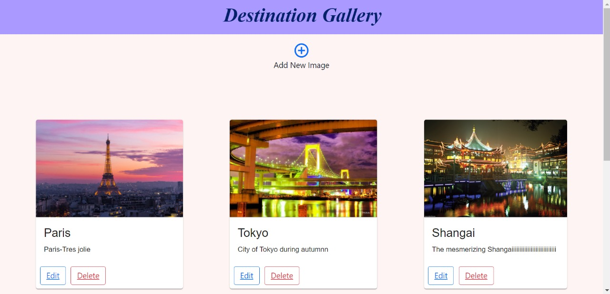
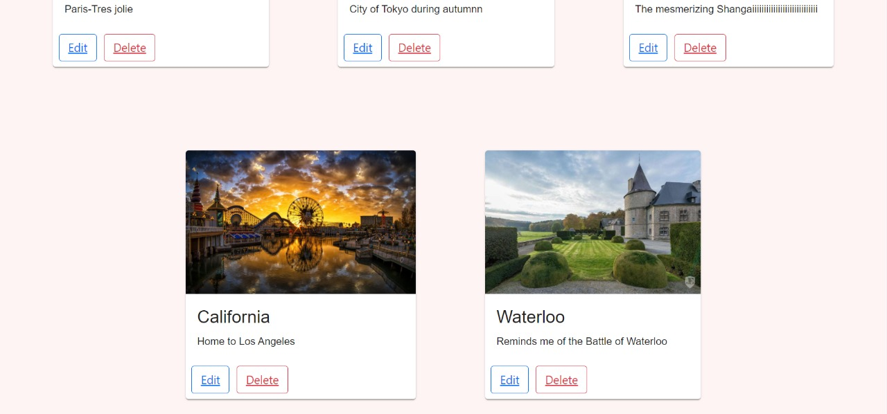
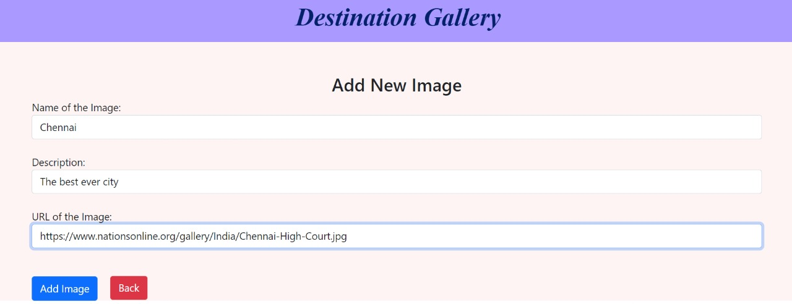
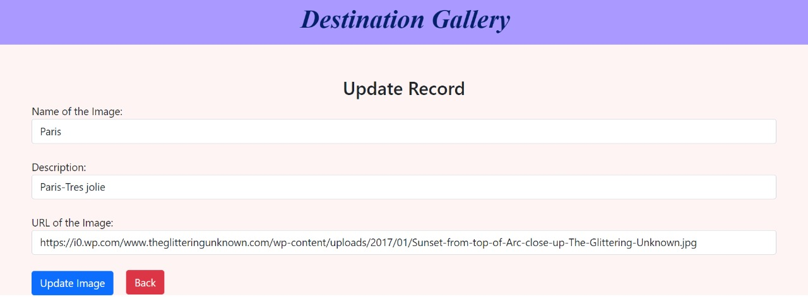
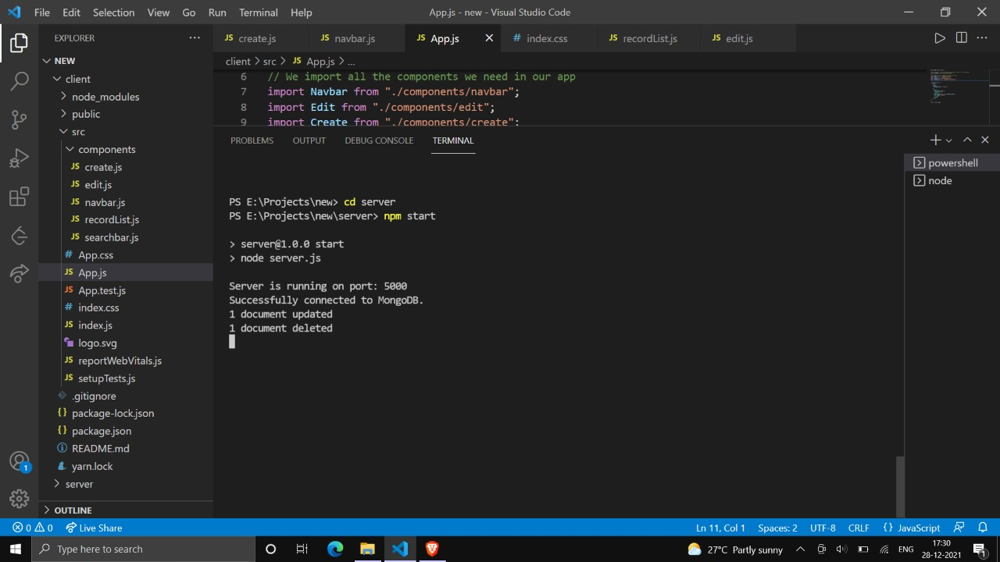

## Gallery CRUD APP [Hackerearth Full Stack Problem Setter Intern Test]

### App Name :- Destination Gallery

#### Technical Stack(old project)

* Frontend :-  Reactjs
* UI :- Material UI,Bootstrap Version 5
* Backend Database :- MongoDB
* Backend Server :- ExpressJS
* Runtime Environment :- NodeJS

